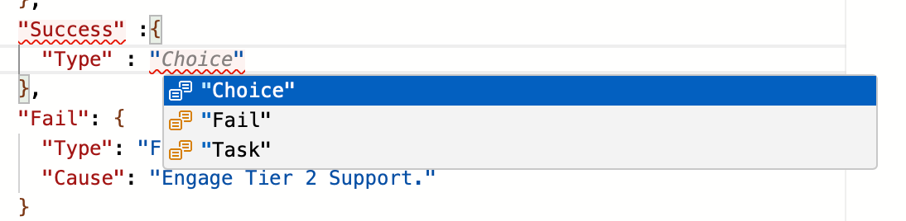

# What is Step Function?

Step Functions is a serverless orchestration service that lets you easily coordinate multiple Lambda functions into flexible workflows that are easy to debug and change. Step Functions will keep your Lambda functions free of additional logic by triggering and tracking each step of your application for you.

## Pre-requisite to create Step Function?

You should have a custom IAM role that you can assign to your StepFunctions.

If you want to use Lambdas, then you should have an IAM role that allows Step Functions to access Lambda.

## What are different components in Step Function?

"States": An object containing a comma-delimited set of states.

Example:

{

  "Comment": "A simple AWS Step Functions state machine that automates a call center support session.",

  "StartAt": "Open Case",

  "States": {

    "Open Case": {

    "Type": "Task",

    "Resource": "arn:aws:lambda:ca-central-1:507638485545:function:OpenCaseFunction",

    "Next": "Assign Case"

    },

    }

}

"Task": A Task state represents a single unit of work performed by a state machine. All work in your state machine is done by tasks. A task performs work identified by the state’s Resource field, which is often an AWS Lambda function or other Step Functions service integrations.

Example:

"States": {

    "Open Case": {

    "Type": "Task", //

    "Resource": "arn:aws:lambda:ca-central-1:507638485545:function:OpenCaseFunction", // A URI, especially an ARN that uniquely identifies the specific task to execute.

    "Next": "Assign Case" // The name of the next state that is run when the current state finishes.

    },

}

If you want to create a choice (if and else) in your worklow, then select the "Type" : "Choice"

Example:

"Is Case Resolved": {

    "Type": "Choice",

    "Choices": [

    {

    "Variable": "$.Status",

    "NumericEquals": 1,

    "Next": "Close Case"

    },

    {

    "Variable": "$.Status",

    "NumericEquals": 0,

    "Next": "Escalate Case"

    }

    ]

    },

Options for State: Choice, Fail, Task, Pass, Wait

# What is a Lambda Function?

AWS Lambda is a compute service that lets you run code without provisioning or managing servers.

## Pre-requisite to create a Lambda Function

When creating a Lambda Function, you will be asked three options.

1. Create from Scratch
2. Create from Template
3. Create from Container Image

Also, you will be allowed to select a programming language (Node.js, Python), along with the architecutre on which your lambda would run (arc86, or arm64)

Furthermore, you need an IAM execution role: Choose a role that defines the permissions of your function.

Default setting: Lambda will create an execution role named MockAPIFunction-role-xxx, with permission to upload logs to Amazon CloudWatch Logs.
