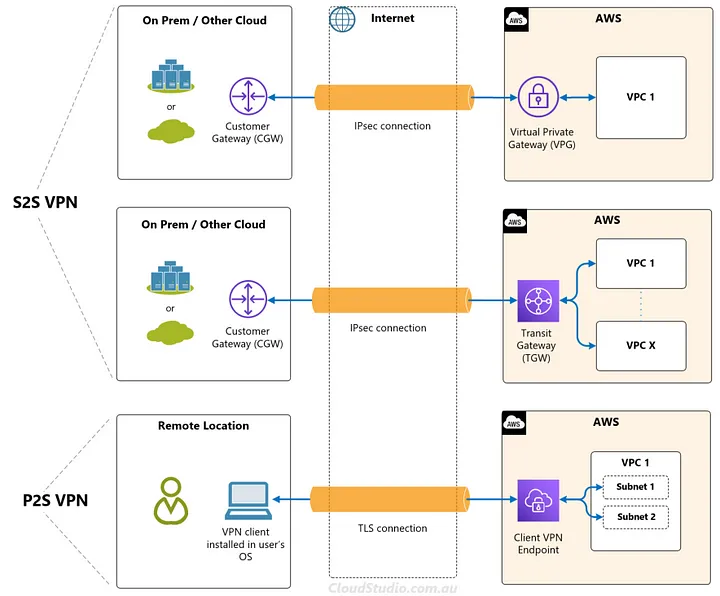
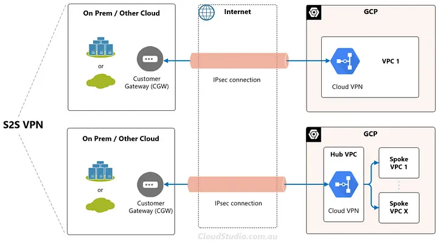
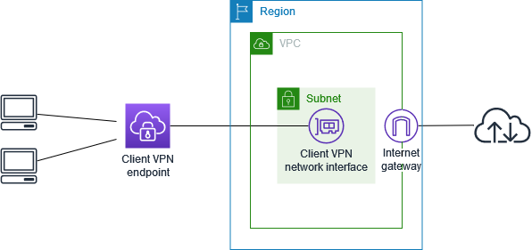
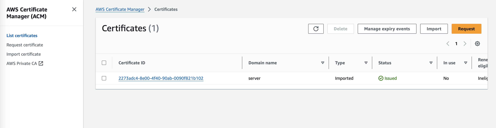
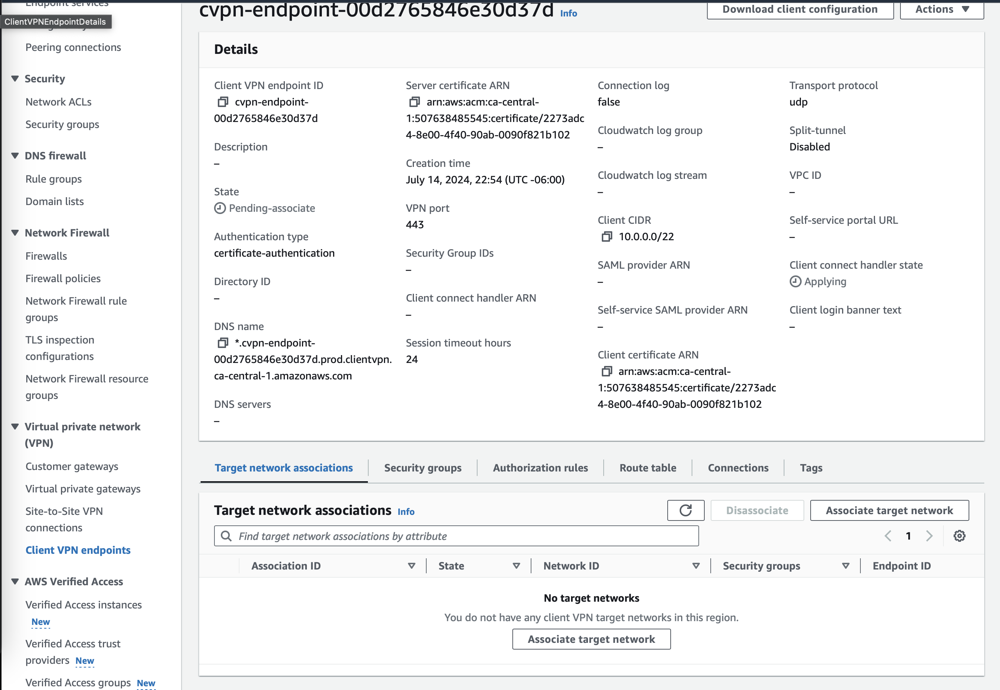
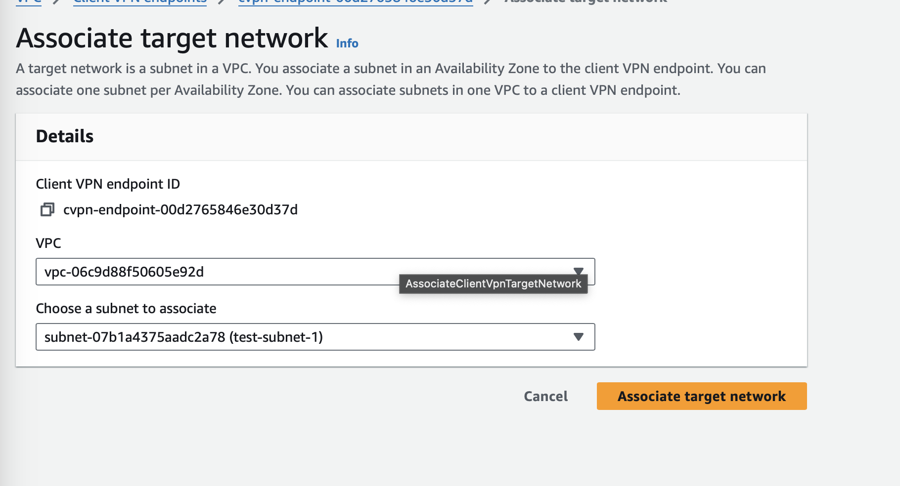

# What is an AWS VPN?

It is an AWS service that lets you connect your on-premises networks and remote workers to the cloud.

**Types of VPN**

1. Client VPN

   1. AWS Client VPN is a fully managed, elastic VPN service that automatically scales up or down based on user demand. Because it is a cloud VPN solution, you don’t need to install and manage hardware or software-based solutions, or try to estimate how many remote users to support at one time.
   2. This is used for P2S connections, which can enable remote users to connect to a VPC instead.
2. Site-to-Site VPN

   1. AWS Site-to-Site VPN creates a secure connection between your data center or branch office and your AWS cloud resources. For globally distributed applications, the accelerated Site-to-Site VPN option provides even greater performance by working with AWS Global Accelerator.
   2. VGW can be setup as VPN endpoint for a VPN connection to one AWS VPC
   3. TGW can be setup to route the VPN connection to multiple VPCs.

In Case of GCP, it provides a fully-managed P2S VPN service.

In the hub-spoke scenario above, you would have to setup peering connections between the Hub VPC and the Spoke VPC. GCP doesn't offer a direct transitive option between their spoke VPCs.

VPC Peering and VPN peering are different in all the clouds. 

You can connect two VPCs by establishing a VPN peering, but that's just a workaround.
Officially, if you want to share the VPCs in GCP, then use following two services:

1. Shared VPC (for central management, across the projects, within same org)
2. VPC Peering (for within the project, different organizations, not centrally managed)

# Tutorial

In this tutorial you will create a Client VPN endpoint that does the following:

* Provides all clients with access to a single VPC.
* Provides all clients with access to the internet.
* Uses mutual authentication.

**Step 1:**

This tutorial uses mutual authentication. With mutual authentication, Client VPN uses certificates to perform authentication between clients and the Client VPN endpoint. You will need to have a server certificate and key, and at least one client certificate and key. At minimum, the server certificate will need to be imported into AWS Certificate Manager (ACM) and specified when you create the Client VPN endpoint. Importing the client certificate into ACM is optional.

If you don't already have certificates to use for this purpose, they can be created using the OpenVPN easy-rsa utility. For detailed steps to generate the server and client certificates and keys using the OpenVPN easy-rsa utility, and import them into ACM see Mutual authentication.

Link: https://github.com/OpenVPN/easy-rsa, https://docs.aws.amazon.com/vpn/latest/clientvpn-admin/mutual.html

How to generate server and client certificates and keys and upload them to ACM

- https://docs.aws.amazon.com/vpn/latest/clientvpn-admin/mutual.html

Now go to ACM, and import the server certificate

It will look something like above.

Step 2:

Create the Client VPN endpoint -> Client VPN endpoint is the resource that you create and configure to "enable and manage client VPN sessions". It's the termination point for all client VPN sessions.

You can select the server and client certificate as same, if the issuing authority (CA) is same. 

Step 3: 

Associate a target network

To allow clients to establish a VPN session, you associate a target network with the Client VPN endpoint. A target network is a subnet in a VPC

You can associate one or more target networks (subnets in your VPC) with a client VPN endpoint. A client VPN endpoint must have at least one target network to enable clients to connect to it and establish a VPN connection.

When you associate the VPN to the target VPC network, it means Clients would be able to use the resources available in the target VPC using the VPN endpoint. 

Just make sure that the subnet that you are selecting is not overlapping with the Client CIDR. 

Client CIDR needs a minimum of 22 and a maximum of 12 netmask.

For example: Create the client CIDR as 10.0.32.0/22 and the Target VPC subnet CIDR as 10.0.0.0/26.

Step 4:

For clients to access the VPC, there needs to be a route to the VPC in the Client VPN endpoint's route table and an authorization rule. The route was already added automatically in the previous step. For this tutorial, we want to grant all users access to the VPC.

Step 5: 

You can provide access to additional networks connected to the VPC, such as AWS services, peered VPCs, on-premises networks, and the internet. For each additional network, you add a route to the network in the Client VPN endpoint's route table and configure an authorization rule to give clients access.

For this tutorial, we want to grant all users access to the internet and also to the VPC. You've already configured access to the VPC, so this step is for access to the internet.

Step 6: Verify security group requirements

In this tutorial, no security groups were specified during the creation of the Client VPN endpoint in Step 2. That means that the default security group for the VPC is automatically applied to the Client VPN endpoint when a target network is associated. As a result, the default security group for the VPC should now be associated with the Client VPN endpoint.

Step 7: Download the Client VPN endpoint configuration file

The next step is to download and prepare the Client VPN endpoint configuration file. The configuration file includes the Client VPN endpoint details and certificate information required to establish a VPN connection. You provide this file to the end users who need to connect to the Client VPN endpoint. The end user uses the file to configure their VPN client application.

Distribute the Client VPN endpoint configuration file to your end users by changing the certificate key value in the download Client VPN endpoint configuration file.
